# UniNotas — App de Notas por Carpetas

Aplicación móvil desarrollada en **Flutter** para crear, editar, consultar, eliminar y organizar notas locales dentro de carpetas personalizadas.

<br>
<div align="center">
<table>
<tr>
<td align="center">
<b>Escudo UNISON</b><br><br>

</td>
<td align="center">
<b>Icono de la app</b><br><br>

</td>
<td align="center">
<b>Logo Unison</b><br><br>

</td>
</tr>
</table>
</div>

---

## 👨‍💻 Integrantes

- Daniel Morales
- Dilan Bañuelos

---

## 📌 Descripción del proyecto

`UniNotas` es una libreta de notas local organizada por carpetas. La aplicación está pensada para uso personal y académico: permite crear categorías (Escuela, Trabajo, Pendientes, Personal), y administrar notas con metadatos como color y carpeta asociada.

Características principales:

- Almacenamiento local con Hive (sin sincronización en la nube).
- Crear, editar y eliminar notas con título obligatorio y contenido opcional.
- Organización por carpetas: crear/editar/eliminar carpetas; al eliminar una carpeta las notas se reasignan a la carpeta General.
- Búsqueda por título, contenido o carpeta.
- Selección de color para cada nota y vista previa en tarjetas.
- Interfaz con estilo institucional UNISON.

---

## 🛠 Tecnologías utilizadas

- Flutter SDK (3.x)
- Dart (3.x)
- Hive, hive_flutter
- uuid
- flutter_colorpicker (u otras utilidades de UI)

---

## 🧩 Estructura del proyecto (`lib/`)

```bash
lib/
├── main.dart
├── app.dart
├── data/
│   └── notes_repo.dart           # Persistencia local con Hive
├── models/
│   ├── category.dart             # Modelo de carpeta
│   └── note.dart                 # Modelo de nota (id, title, body, color, folderId, createdAt)
├── screens/
│   ├── welcome_screen.dart
│   ├── notes_screen.dart         # Lista filtrable y búsqueda
│   ├── note_form_screen.dart     # Crear / Editar nota
│   └── note_view_screen.dart     # Ver nota en detalle
├── widgets/
│   ├── color_picker.dart
│   └── note_card.dart            # Tarjeta visual para cada nota
└── utils/
    ├── constants.dart
    └── date_format.dart
```

---

## 🔍 Clases y componentes clave

- `Note` (models/note.dart): contiene `id`, `title`, `body`, `colorHex`, `folderId`, `createdAt`, `updatedAt`.
- `Category` (models/category.dart): `id`, `name`, `colorHex`, `order`.
- `NotesRepository` (data/notes_repo.dart): interfaz para leer/escribir notas y carpetas en Hive; mueve notas a `General` al borrar carpetas.
- `NotesScreen`: lista con filtros por carpeta y barra de búsqueda; muestra `NoteCard` con color y acciones rápidas.
- `NoteFormScreen`: validación del título obligatorio y selección de carpeta y color.

---

## 🎯 Flujo de la aplicación

1. `WelcomeScreen` muestra la marca y acceso a `NotesScreen`.
2. `NotesScreen` muestra las notas por defecto de la carpeta seleccionada.
3. El usuario puede crear o editar notas en `NoteFormScreen`.
4. Al eliminar una carpeta, `NotesRepository` reasigna notas a la carpeta `General`.

---

## 🖼 Imágenes y capturas

Se incluyen capturas de pantalla y recursos en `assets/images` y `assets/screenshots`.

### Capturas (pantallas)

<div align="center">
<table>
<tr>
<td align="center">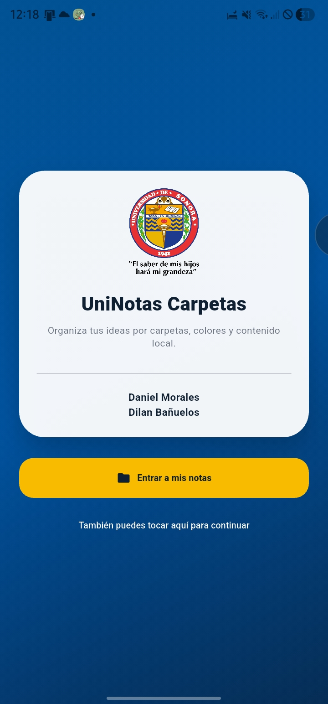</td>
<td align="center">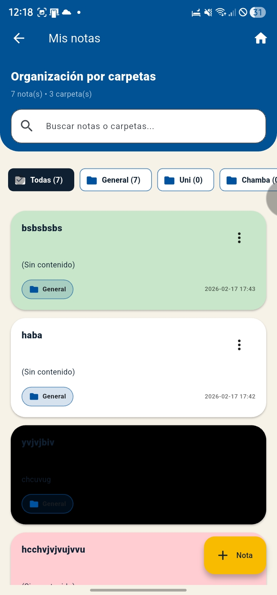</td>
<td align="center">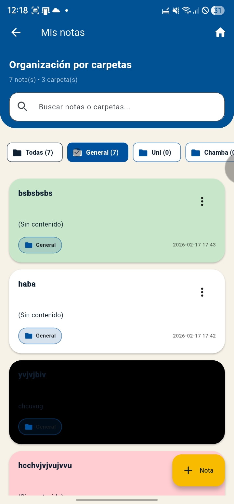</td>
</tr>
</table>
</div>

<div align="center">
<table>
<tr>
<td align="center">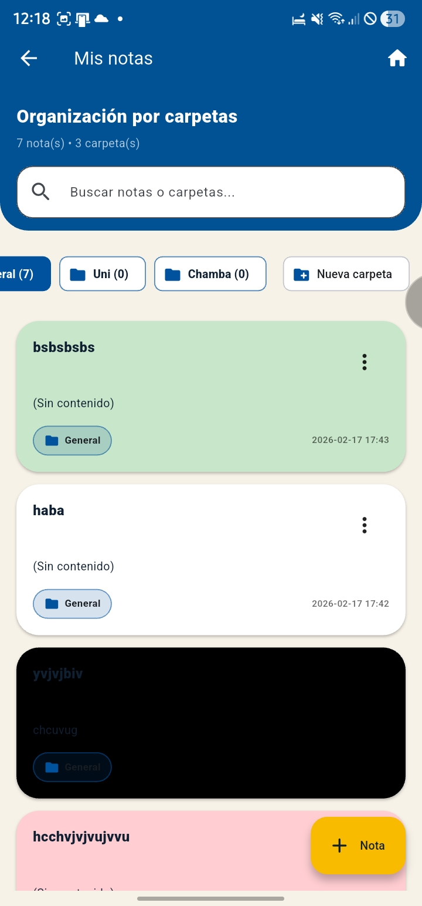</td>
<td align="center">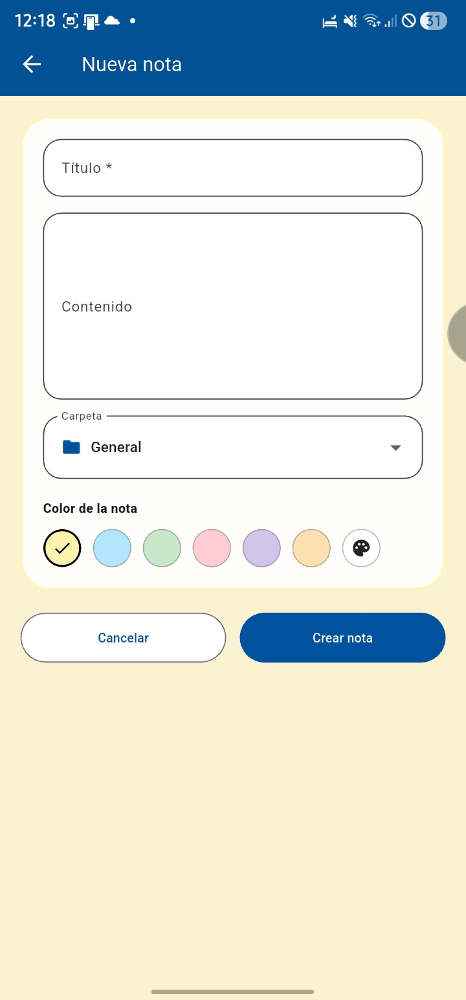</td>
<td align="center">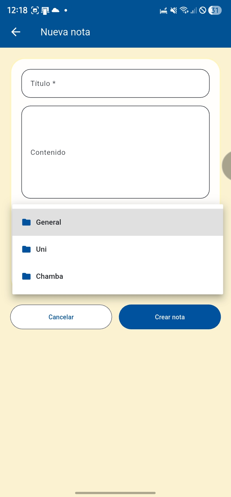</td>
</tr>
</table>
</div>

<div align="center">
<table>
<tr>
<td align="center">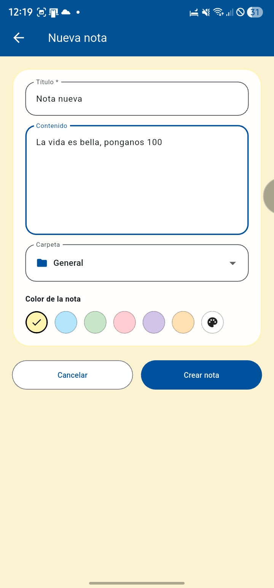</td>
<td align="center">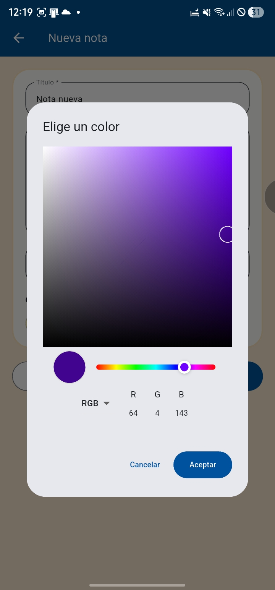</td>
<td align="center">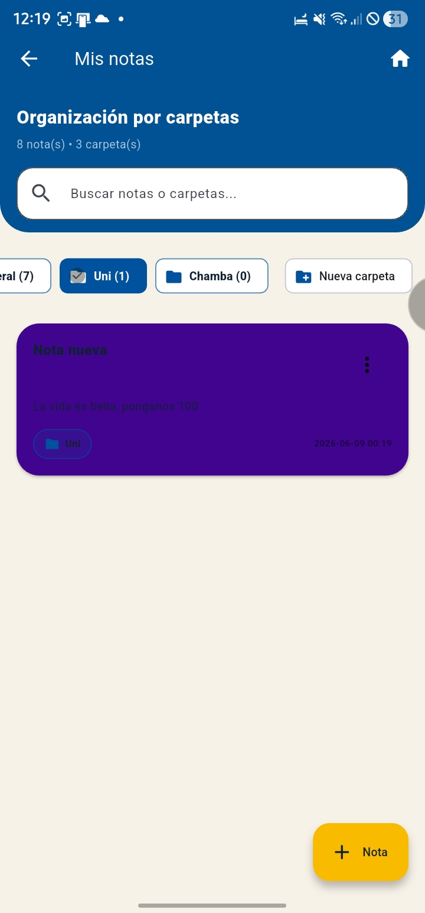</td>
</tr>
</table>
</div>

<div align="center">
<table>
<tr>
<td align="center">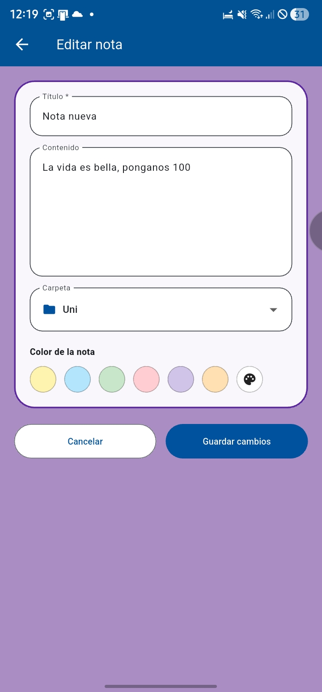</td>
<td align="center">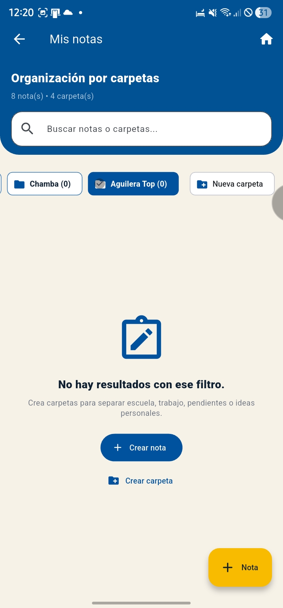</td>
<td align="center">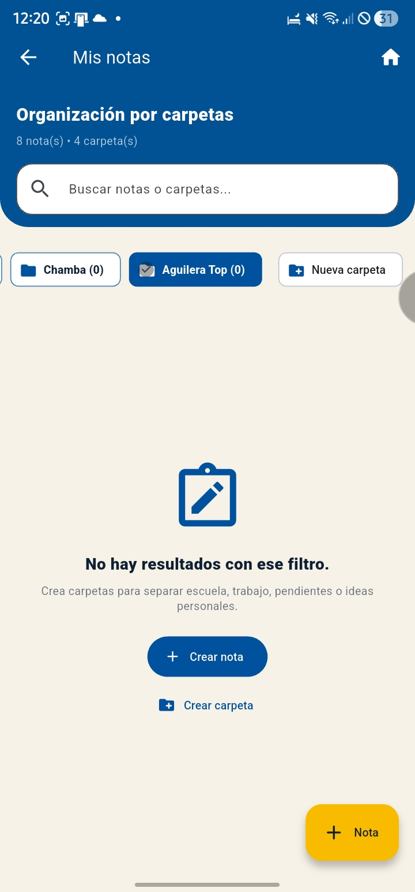</td>
</tr>
</table>
</div>

<div align="center">
<table>
<tr>
<td align="center"></td>
<td align="center">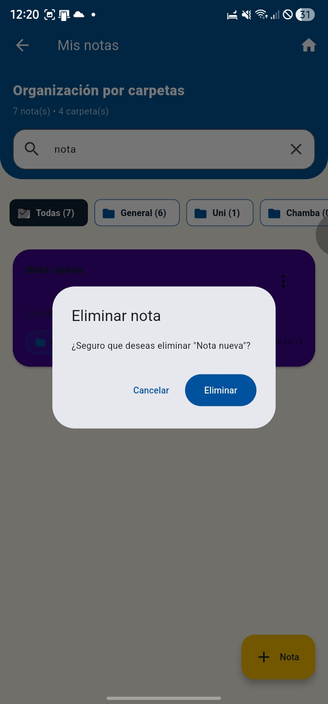</td>
<td align="center"></td>
</tr>
</table>
</div>

<div align="center">
<table>
<tr>
<td align="center">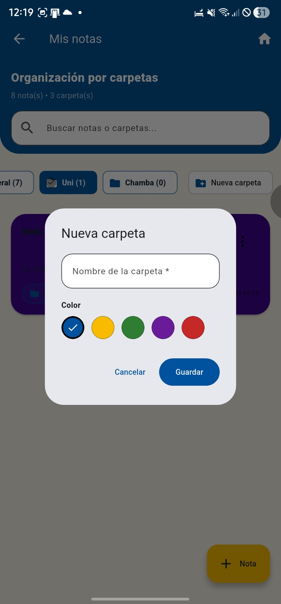</td>
</tr>
</table>
</div>

---

## ▶️ Instrucciones para ejecutar

```bash
flutter clean
flutter pub get
flutter run
```

### Generar APK

```bash
flutter build apk --release
```

Archivo generado:

```
build/app/outputs/flutter-apk/app-release.apk
```

---

## 🧪 Estado actual

- ✅ Aplicación local por carpetas con creación/edición/eliminación de notas
- ✅ Búsqueda y filtrado por carpeta
- ✅ Persistencia local con Hive

---
